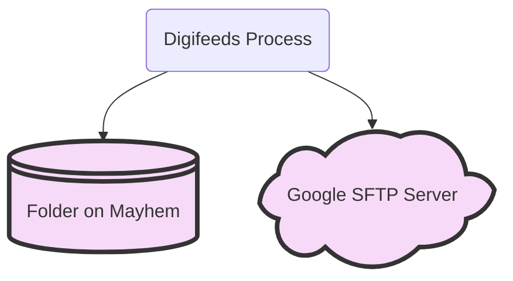
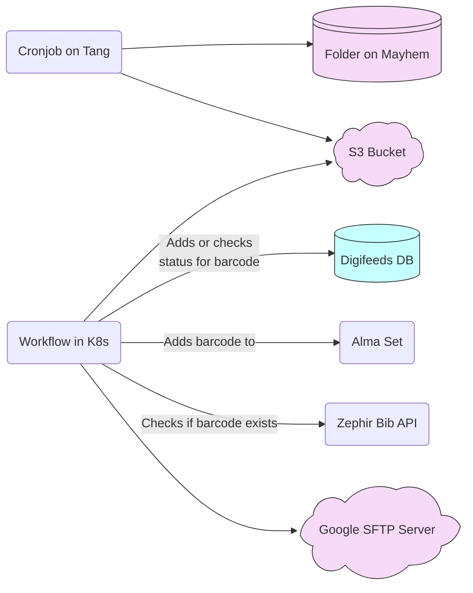
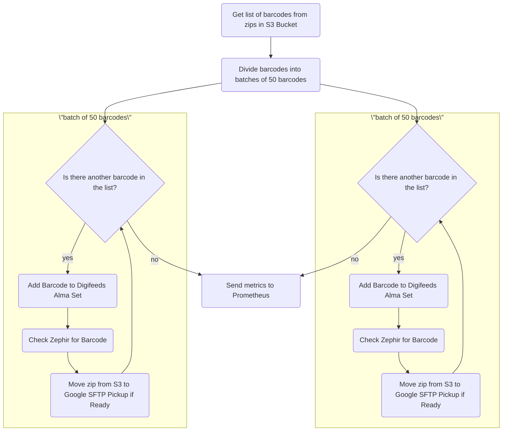
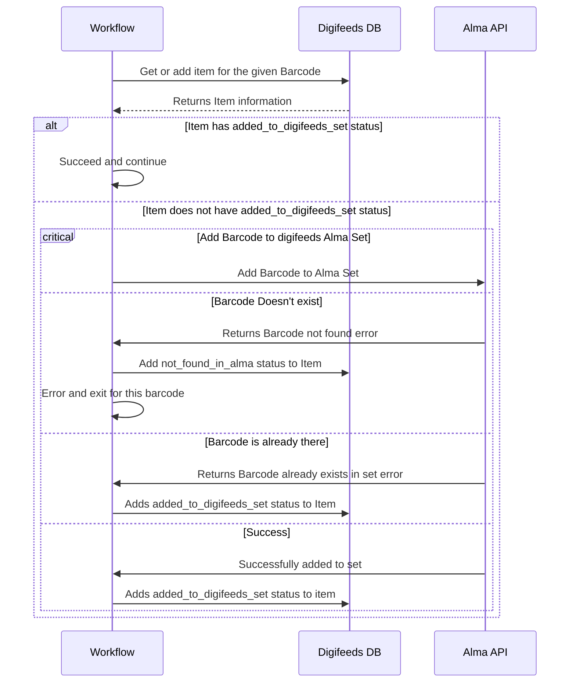
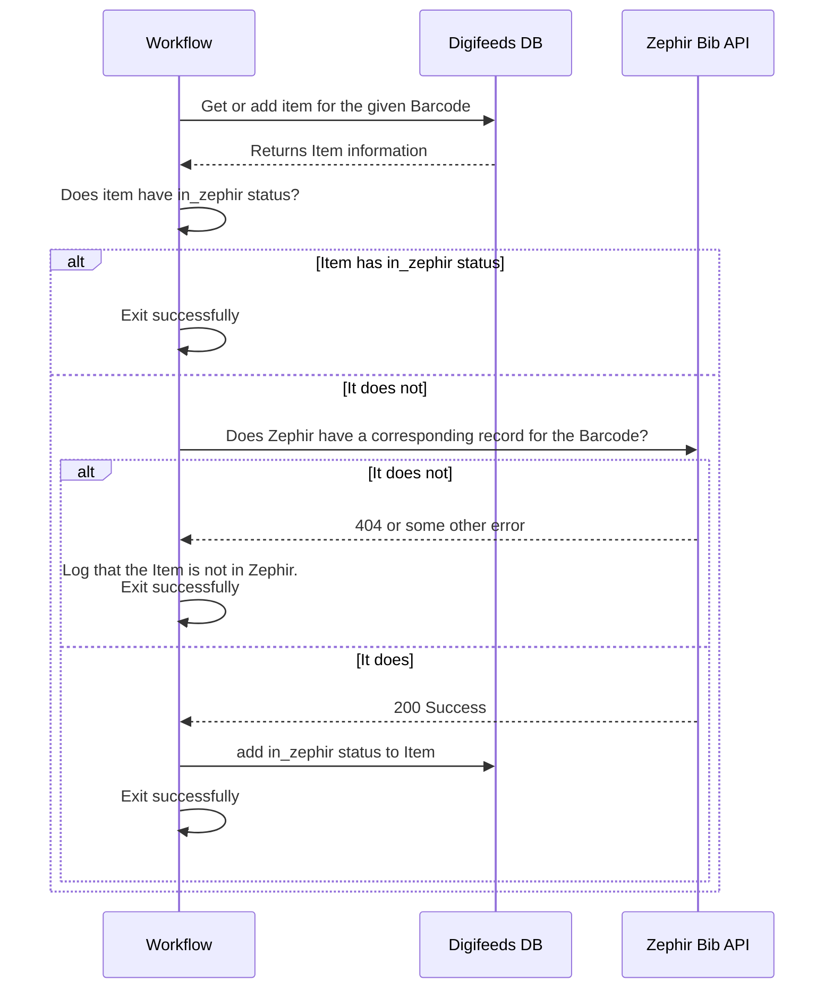
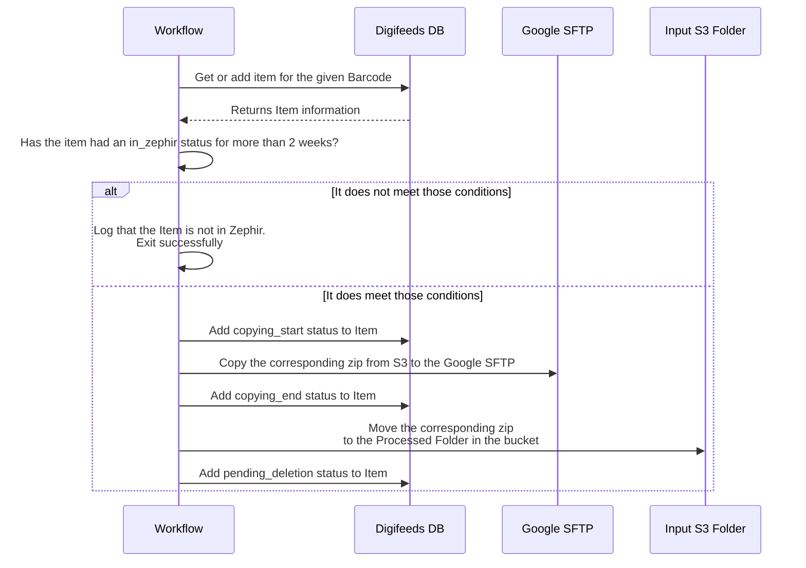
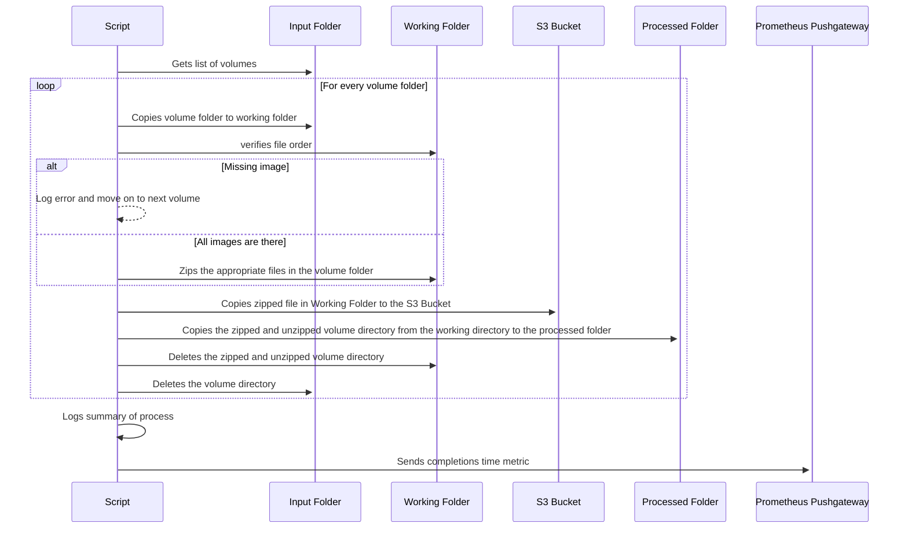

# Diagrams in Confluence

These are backups of the diagrams in confluence, so we can more easily edit them.

## High level overview

## Digifeeds Process in more detail

## Overview of Digifeeds Process CronWorkflow

## Process Digifeeds Add Item to Digifeeds Set

## Check Zephir for Barcode

## Move Zip from S3 to Google SFTP for pickup

## Cronjob on Tang

