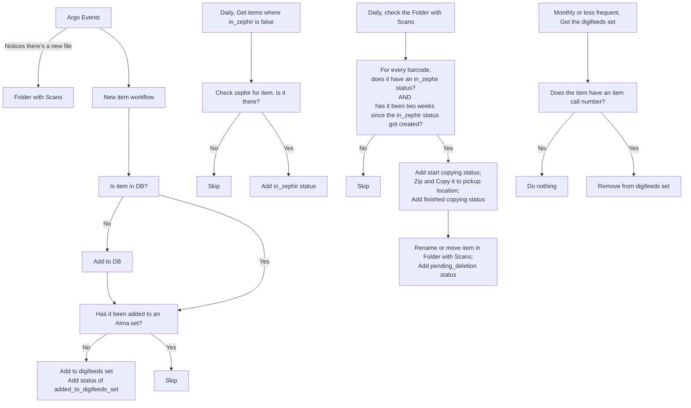
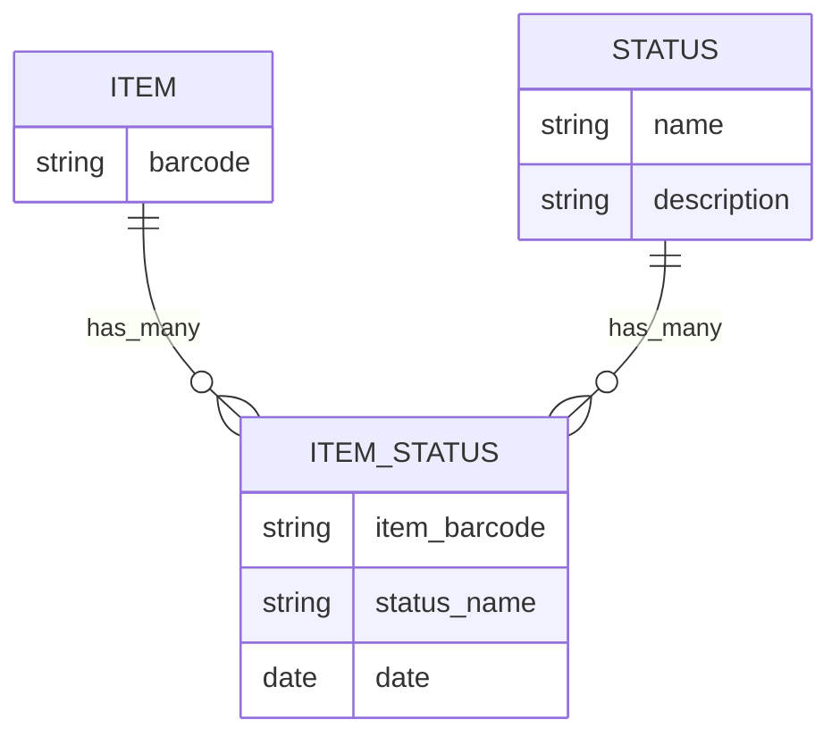

# Proposed Digifeeds Process
## Overview

## Database tables


## CLI scripts
```
aim digifeeds check_zephir
aim digifeeds zip_and_move_to_pickup
aim digifeeds add_to_db BARCODE
aim digifeeds purge_digifeeds_alma_set
```
