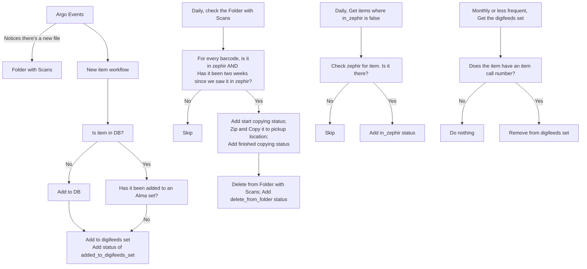

# Proposed Digifeeds Process

```mermaid
flowchart TD
    A[Folder with Scans]
    B[Argo Events]
    C[New item workflow]

    B --Notices there's a new file--> A
    B --> C
    C --> D[Is item in DB?]
    D --No --> F[Add to DB]
    F --> G[Add to digifeeds set\nAdd status of added_to_digifeeds_set]
    D --Yes--> E[Has it been added to an Alma set?]
    E --No --> G

    H[Daily, check the Folder with Scans] --> I[For every barcode, is it\nin zephir AND \nHas it been two weeks since we saw it in zephir?]
    I --No --> N[Skip]
    I --Yes--> J[Add start copying status;\nZip and Copy it to pickup location;\nAdd finished copying status]
    J --> K[Delete from Folder with Scans; Add delete_from_folder status]

    L[Daily, Get items where in_zephir is false] --> M[Check zephir for item. Is it there?]
    M --No -->O[Skip]
    M --Yes -->P[Add in_zephir status]

    Q[Monthly or less frequent, Get the digifeeds set] --> R[Does the item have an item call number?]
    R -- No --> S[Do nothing]
    R --Yes --> T[Remove from digifeeds set]
```
