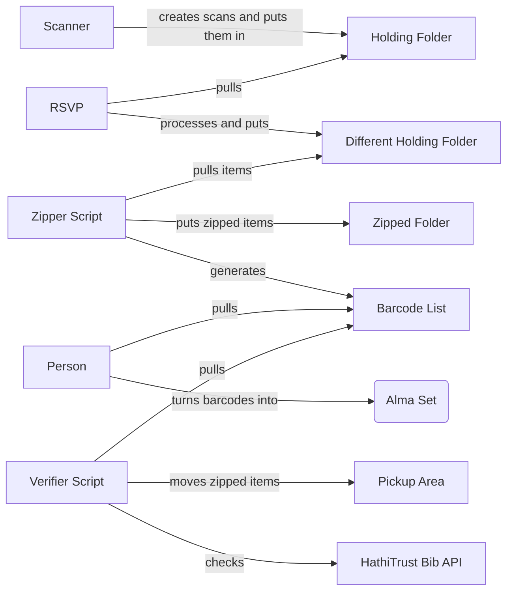
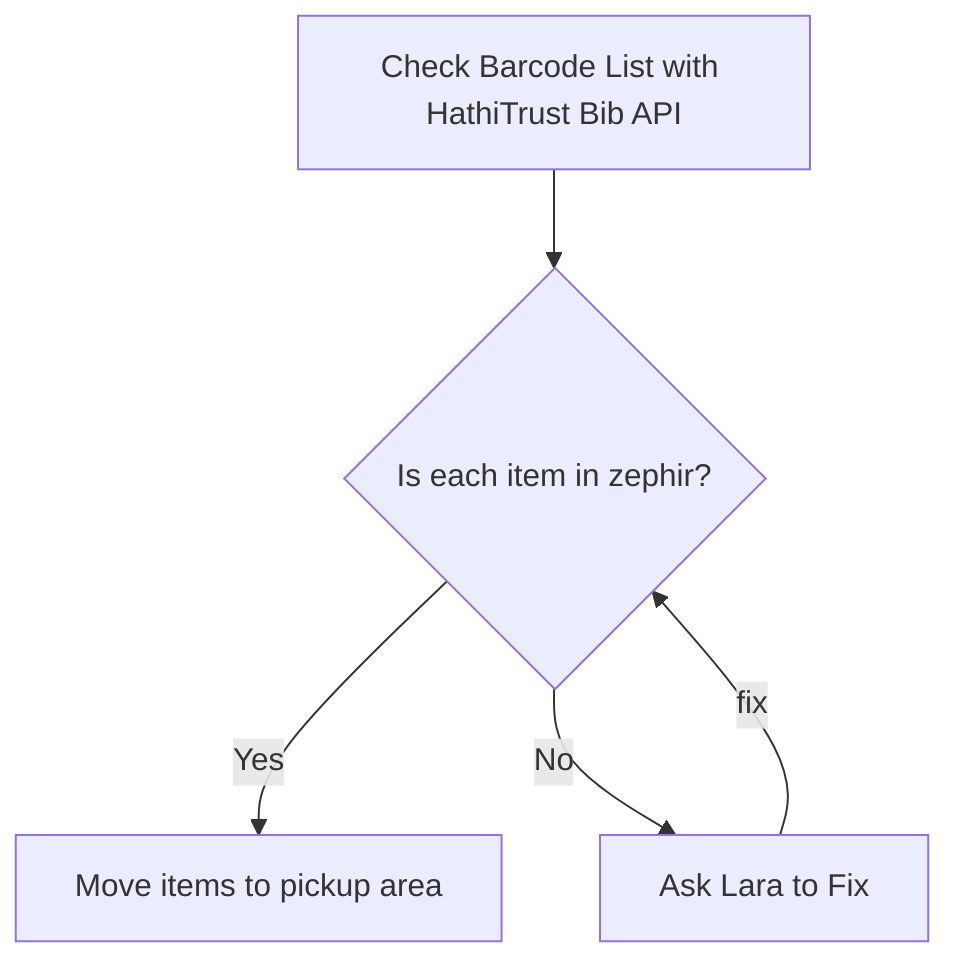

# Old Digifeeds Process

This is what the digifeeds process was before we switched to the one handled in
by this application.

## Overall Process

```mermaid
flowchart LR
    A[Scanner] -->|creates scans and puts them in| B[Holding Folder]
    RSVP --> |pulls| B
    RSVP --> |processes and puts| K[Different Holding Folder]
    C[Zipper Script] --> |pulls items| K
    C --> |puts zipped items| D[Zipped Folder]
    C --> |generates| E[Barcode List] 
    F[Person] --> |pulls| E
    F --> |turns barcodes into| G(Alma Set)  
     H[Verifier Script] --> |pulls| E
    H--> |moves zipped items| I[Pickup Area]

    H --> |checks| J[HathiTrust Bib API]
```

## Verifier Script

```mermaid
flowchart TD
    A[Check Barcode List with HathiTrust Bib API ] --> B{Is each item in zephir?}
    B --> |Yes| C[Move items to pickup area]
    B --> |No| D[Ask Lara to Fix]
    D --> |fix| B
```
