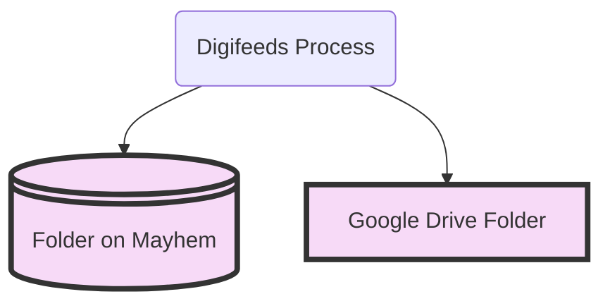
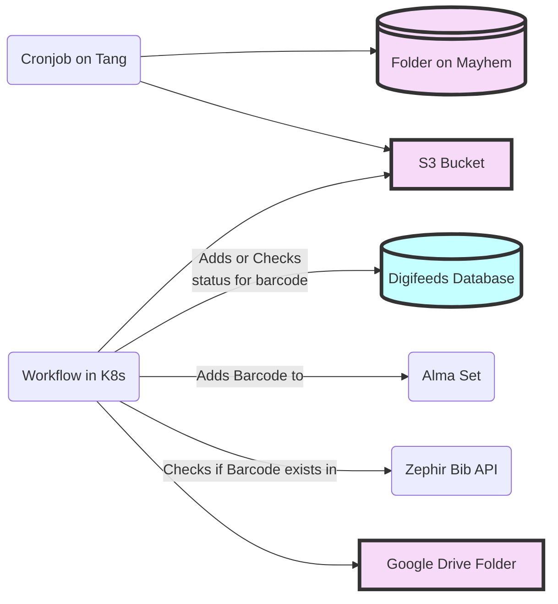

# Digifeeds Overview

This is a place to store the mermaid.js code for the [Digifeeds documentation in Confluence](https://mlit.atlassian.net/wiki/spaces/LSO/pages/10388733957/Digifeeds+Process).

## Highest Level Flowchart



## Medium Level Flowchart



## Cronjob on Tang Sequence Diagram

```mermaid
sequenceDiagram
    Script->>+Input Folder: Gets the list of Volume Folders
    loop For every Volume Folder
      Script->>Input Folder: Copies Volume Folder to working folder
      Script->>Working Folder: verifies file order
      alt Missing image
        Script->>Script: Log error and move on to next Volume Folder
      else All images are there
        Script->>Working Folder: Zips the appropriate files in the Volume Folder 
      end
      Script->>+S3 Bucket: Copies zipped file in Working Folder to the S3 Bucket
      Script->>+Processed Folder: Copies the zipped and unzipped Volume Folder from the Working Folder to the Processed Folder
      Script->>Working Folder: Deletes the zipped and unzipped Volume Folder
      Script->>Input Folder: Deletes the Volume Folder 
    end
    Script->>Script: Logs summary of script run
    Script->>+Prometheus Pushgateway: Sends metrics
 ```
