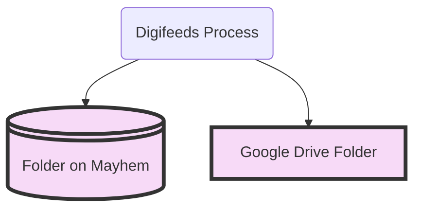
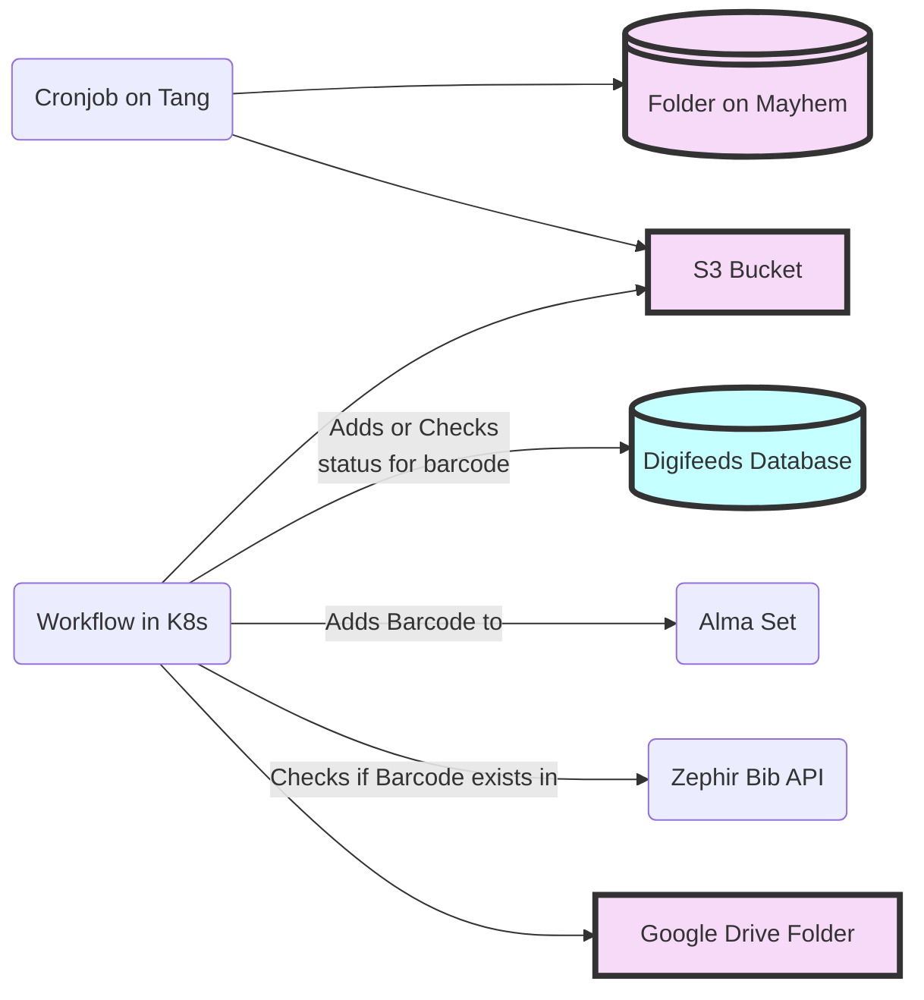

# Digifeeds Overview

This is a place to store the mermaid.js code for the [Digifeeds documentation in Confluence](https://mlit.atlassian.net/wiki/spaces/LSO/pages/10388733957/Digifeeds+Process).

## Highest Level Flowchart



## Medium Level Flowchart



## Cronjob on Tang Sequence Diagram

```mermaid
sequenceDiagram
    Script->>+Input Folder: Gets the list of Volume Folders
    loop For every Volume Folder
      Script->>Input Folder: Copies Volume Folder to working folder
      Script->>Working Folder: verifies file order
      alt Missing image
        Script->>Script: Log error and move on to next Volume Folder
      else All images are there
        Script->>Working Folder: Zips the appropriate files in the Volume Folder 
      end
      Script->>+S3 Bucket: Copies zipped file in Working Folder to the S3 Bucket
      Script->>+Processed Folder: Copies the zipped and unzipped Volume Folder from the Working Folder to the Processed Folder
      Script->>Working Folder: Deletes the zipped and unzipped Volume Folder
      Script->>Input Folder: Deletes the Volume Folder 
    end
    Script->>Script: Logs summary of script run
    Script->>+Prometheus Pushgateway: Sends metrics
 ```

## Process Barcodes in K8s

```mermaid
sequenceDiagram
    Workflow->>+Input S3 Folder: Gets the list of barcodes from zips
    par For every Barcode
      Workflow ->> Digifeeds DB: Get or add item for the given Barcode
      Digifeeds DB ->> Workflow: Returns Item information
      alt Item has added_to_digifeeds_set status
        Workflow ->> Workflow: Succeed and continue
      else Item does not have added_to_digifeeds_set status
        critical Add Barcode to digifeeds Alma Set
          Workflow->>Alma API: Add Barcode to Alma Set
        option Barcode Doesn't exist
          Alma API ->> Workflow: Returns Barcode not found error
          Workflow ->> Digifeeds DB: Add not_found_in_alma status to Item
          Workflow ->> Workflow: Error and exit for this barcode
        option Barcode is already there
          Alma API ->> Workflow: Returns Barcode already exists in set error
          Workflow ->> Digifeeds DB: Adds added_to_digifeeds_set status to Item
        option Success
          Alm API ->> Workflow: Successfully added to set
          Workflow->>Digifeeds DB: Adss added_to_digifeeds_set status to item
        end
      end 
      Workflow ->> Workflow: Check if the Item has an in_zephir status
      alt It does
        Workflow ->> Workflow: Succeed and continue
      else It does not 
        Workflow ->> Zephir Bib API: Does Zephir have a corresponding record for the Barcode?
        alt It does not
          Zephir Bib API -->> Workflow: 404 or some other error
          Workflow ->> Workflow: Log that the Item is not in Zephir.<br>Succeed and Continue
        else It does
          Zephir Bib API -->> Workflow: 200 Success
          Workflow ->> Digifeeds DB: add in_zephir status to Item
          Workflow ->> Workflow: Succeed and Continue
        end
      end
      Workflow ->> Workflow: check if the Item has in_zephir status AND<br> has had it for more than two weeks
      alt It does not meet those conditions
        Workflow ->> Workflow: Log that the Item is not in Zephir. Succeed and Continue
      else It does meet those conditions
        Workflow ->> Digifeeds DB: Add copying_start status to Item
        Workflow ->> Google Drive: Copy the corresponding zip from S3 to the Google Drive
        Workflow ->> Digifeeds DB: Add copying_end status to Item
        Workflow ->> Input S3 Folder: Move the corresponding zip<br> to the Processed Folder in the bucket
        Workflow ->> Digifeeds DB: Add pending_deletion status to Item
      end
    end
    Workflow->>+Prometheus Pushgateway: Sends metrics
```

## Add to Alma Set

```mermaidjs
sequenceDiagram
      Workflow ->> Digifeeds DB: Get or add item for the given Barcode
      Digifeeds DB ->> Workflow: Returns Item information
      alt Item has added_to_digifeeds_set status
        Workflow ->> Workflow: Succeed and continue
      else Item does not have added_to_digifeeds_set status
        critical Add Barcode to digifeeds Alma Set
          Workflow->>Alma API: Add Barcode to Alma Set
        option Barcode Doesn't exist
          Alma API ->> Workflow: Returns Barcode not found error
          Workflow ->> Digifeeds DB: Add not_found_in_alma status to Item
          Workflow ->> Workflow: Error and exit for this barcode
        option Barcode is already there
          Alma API ->> Workflow: Returns Barcode already exists in set error
          Workflow ->> Digifeeds DB: Adds added_to_digifeeds_set status to Item
        option Success
          Alma API ->> Workflow: Successfully added to set
          Workflow->>Digifeeds DB: Adss added_to_digifeeds_set status to item
        end
      end 
```

## Check Zephir

```meramidjs
sequenceDiagram
    Workflow ->> Digifeeds DB: Get or add item for the given Barcode
    Digifeeds DB -->> Workflow: Returns Item information
    Workflow ->> Workflow: Does item have in_zephir status?
    alt Item has in_zephir status
      Workflow ->> Workflow: Exit successfully 
    else It does not 
      Workflow ->> Zephir Bib API: Does Zephir have a corresponding record for the Barcode?
      alt It does not
        Zephir Bib API -->> Workflow: 404 or some other error
        Workflow ->> Workflow: Log that the Item is not in Zephir.<br>Exit successfully 
      else It does
        Zephir Bib API -->> Workflow: 200 Success
        Workflow ->> Digifeeds DB: add in_zephir status to Item
        Workflow ->> Workflow: Exit successfully 
      end
    end
```

## Send to Pickup

```mermaidjs
sequenceDiagram
    Workflow ->> Digifeeds DB: Get or add item for the given Barcode
    Digifeeds DB -->> Workflow: Returns Item information
    Workflow ->> Workflow: Has the item had an in_zephir<br> status for more than 2 weeks?

    alt It does not meet those conditions
        Workflow ->> Workflow: Log that the Item is not in Zephir.<br> Exit successfully
      else It does meet those conditions
        Workflow ->> Digifeeds DB: Add copying_start status to Item
        Workflow ->> Google Drive: Copy the corresponding zip from S3 to the Google Drive
        Workflow ->> Digifeeds DB: Add copying_end status to Item
        Workflow ->> Input S3 Folder: Move the corresponding zip<br> to the Processed Folder in the bucket
        Workflow ->> Digifeeds DB: Add pending_deletion status to Item
      end
```

## Process Barcodes High Level Overview

```meramaidjs
flowchart TD
  A(Get list of barcodes from zips in S3 Bucket) 
  B(Divide barcodes into batches of 50 barcodes)
  
  C1{Is there another barcode in the list?} 
  C2(Add Barcode to Digifeeds Alma Set)
  C3(Check Zephir for Barcode)
  C4(Move zip from S3 to Google Drive if Ready)

  D1{Is there another barcode in the list?}
  D2(Add Barcode to Digifeeds Alma Set)
  D3(Check Zephir for Barcode)
  D4(Move zip from S3 to Google Drive if Ready)

  Z(Send metrics to Prometheus)
  
  A --> B
  B --> C1
  B --> D1

  subgraph "batch of 50 barcodes"
    C1 -- yes --> C2
    C2 --> C3
    C3 --> C4
    C4 --> C1
  end
  

  subgraph "batch of 50 barcodes"
    D1 -- yes --> D2
    D2 --> D3
    D3 --> D4
    D4 --> D1
  end

C1 -- no --> Z
D1 -- no --> Z
```
