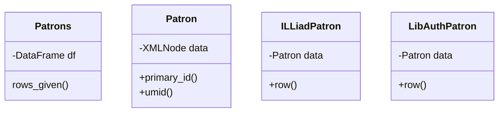

Patron Export
=================

Notes on Patorn Export so that I don't forget.



We would call the program like this:

```bash
python -m aim patron-export libauth --input=/app/tmp/alma_export.xml --output=/app/tmp/output.tsv
python -m aim patron-export illiad --input=/app/tmp/alma_export.xml --output=/app/tmp/output.tsv
```

The typer function would look like:

```python
import pandas as pd:
import csv
def patron_export(kind, input, output):
    df = pd.read_xml(input)
    p = Patrons(df)
    with open(output, "w") as fh:
      writer = csv.writer(rf, delimiter="\t", lineterminator="\n")
      writer.write_rows(p.rows_given(kind))
```

In the classes it'd be something like:

```python
class Patrons:
    def __init__(self, data: DataFrame):
        self.data = data

    def rows_given(kind)
      if kind == "illiad"
         klass = ILLiadPatron
      elif kind == "libauth"
         klass = LibAuthPatron
      return self.data.apply(make_patron) #or something

    def make_patron_row(row,klass):
        return klass(Patron(row)).row()

```

[Client Python](https://prometheus.github.io/client_python/exporting/pushgateway/) can handle reporting to the push gateway.

Or... a separate json report file, that can be added together later and sent to the push gateway. So... Report dataclass? Probably. One that can do incrementing.
