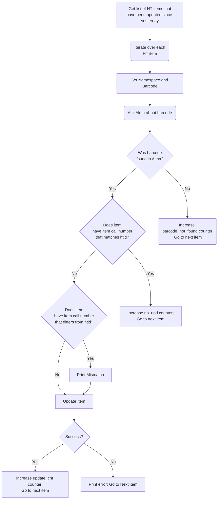

# Update Ingested Items
This is how the perl/bash script currently works, not how it should work.

How to figure out the `barcode`:
* for `miua` and `miun` the `htid` is the `barcode`
* for `mdp` the barcode is everything after `mdp.`

