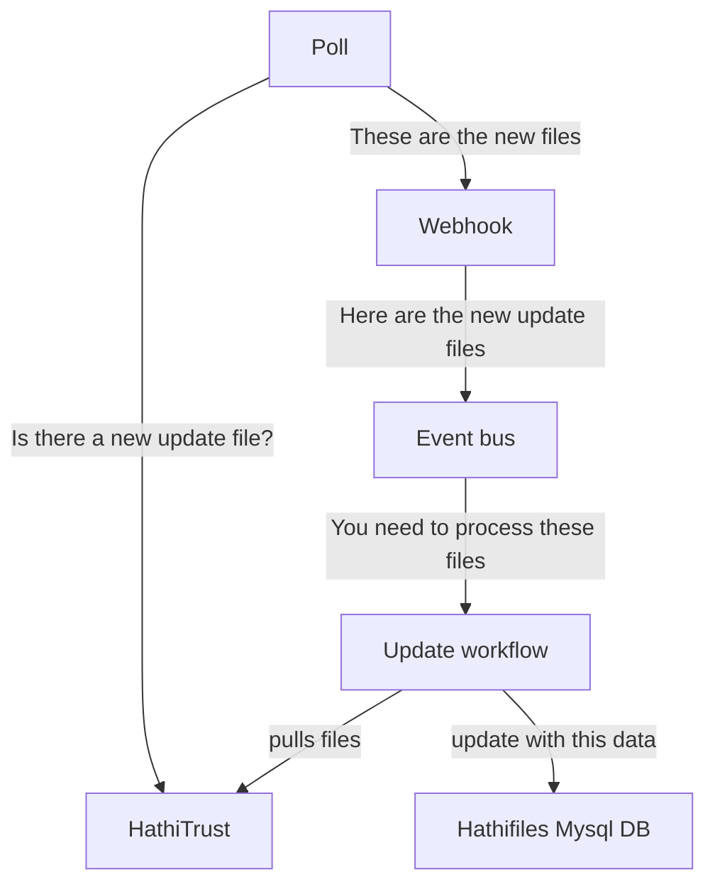

# Hathifiles Diagrams

```mermaid
flowchart TD

p[Poll]
ht["HathiTrust"]
w["Webhook"]
bus["Event bus"]
u["Update workflow"]
db["Hathifiles Mysql DB"]

p--"Is there a new update file?"-->ht
p--"These are the new files"-->w
w--"Here are the new update files"-->bus
bus--"You need to process these files"-->u
u--"pulls files"-->ht
u--"update with this data"-->db
```
