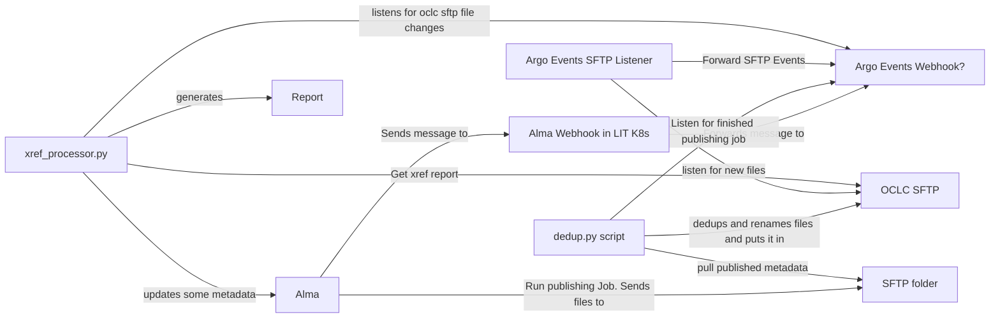

```mermaid
flowchart LR
    A[Alma]
    B[SFTP folder] 
    C[Alma Webhook in LIT K8s]
    D[Argo Events Webhook?]
    E[dedup.py script]
    F[OCLC SFTP]
    G[Argo Events SFTP Listener]
    H[xref_processor.py]
    A -->|Run publishing Job. Sends files to| B   
    A --> |Sends message to| C
    C --> |Forwards message to| D
    E --> |Listen for finished publishing job| D
    E --> |pull published metadata| B
    E --> |dedups and renames files and puts it in| F

    G --> |listen for new files| F
    G --> |Forward SFTP Events| D
    H --> |listens for oclc sftp file changes| D
    H --> |Get xref report| F
    H --> |updates some metadata| A
    H --> |generates| Report
```
