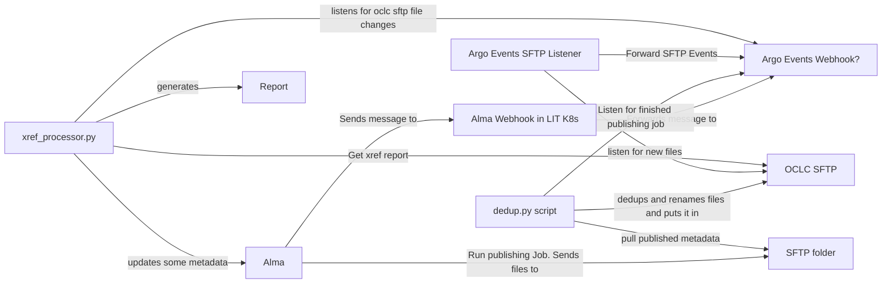

```mermaid
flowchart LR
    A[Alma] -->|Run publishing Job. Sends files to| B[SFTP folder]   
    A --> |Sends message to| C[Alma Webhook in LIT K8s]
    C --> |Forwards message to| D[Argo Events Webhook?]
    E[dedup.py script] --> |Listen for finished publishing job| D
    E --> |pull published metadata| B
    E --> |dedups and renames files and puts it in| F[OCLC SFTP]


    G[Argo Events SFTP Listener] --> |listen for new files| F
    G --> |Forward SFTP Events| D
    H[xref_processor.py] --> |listens for oclc sftp file changes| D
    H --> |Get xref report| F
    H --> |updates some metadata| A
    H --> |generates| Report
```
